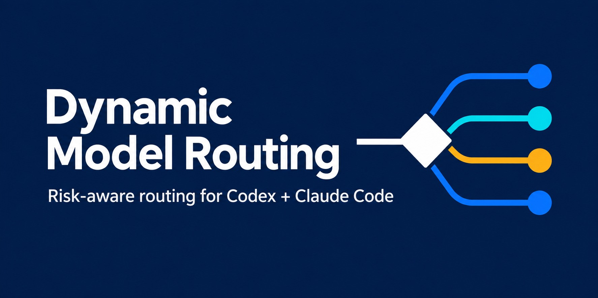

# Dynamic Model Routing

[](https://github.com/iumi-in/dynamic-model-routing/actions/workflows/validate.yml)
[](LICENSE)

<p align="center">
  
</p>

Route coding tasks to the least expensive model that clears the risk bar, while preserving explicit model choices and verification.

Dynamic Model Routing is a native pilot plugin for **Codex CLI and Claude Code CLI**, based on the author's original skill. It classifies work as Clerical, Routine, Sensitive, or Escalation, then uses the host's eligible model-aware workers when available.

The plugin has no daemon, API proxy, API keys of its own, telemetry endpoint, or runtime dependency. It does not automatically switch the active coordinator, enforce monetary caps, or promise savings. Python is needed only for repository checks.

## Support

| Host | Status | Current evidence |
| --- | --- | --- |
| Codex CLI | Pilot | Installation, discovery, and removal verified |
| Claude Code CLI | Pilot | Strict manifest validation and session loading verified |
| Cursor and desktop-specific integrations | Roadmap | No support claim until a native adapter is tested |

## Install in 60 seconds

You need an installed, authenticated coding CLI with native skill and subagent support. Loading was checked on Windows with Codex `0.153.4` and Claude Code `2.1.247`; other versions and operating systems still need their own checks. Native worker execution remains unverified here because the test CLI sessions lacked authentication. See [verification evidence](docs/verification.md).

```text
git clone https://github.com/iumi-in/dynamic-model-routing.git
cd dynamic-model-routing
```

### Claude Code CLI

From this checkout:

```text
claude plugin validate ./plugins/dynamic-model-routing --strict
claude --plugin-dir ./plugins/dynamic-model-routing
```

In the session:

```text
/dynamic-model-routing:dynamic-model-routing Advise on the next task and its acceptance checks.
```

`--plugin-dir` loads the package for that invocation. End the session and omit the flag to stop loading it. The namespaced command distinguishes this plugin from an existing standalone skill with the same name.

### Codex CLI

The included `.agents/plugins/marketplace.json` is a local catalog named `personal`. To install it into your normal Codex profile, run these commands from this checkout:

```text
codex plugin marketplace add .
codex plugin add dynamic-model-routing@personal
codex
```

These are explicit installation commands: they save a marketplace source, plugin configuration, and a cached copy in the current Codex profile. This build used a disposable profile for verification and did not install into your normal profile. If that profile already has a different marketplace called `personal`, resolve the name collision before adding this catalog; do not overwrite an unrelated source.

In the session:

```text
Use $dynamic-model-routing in Advise mode for the next task.
```

Use the skill picker to choose the plugin copy if a standalone skill already has the same name. In a new project, retain its instructions and native trust/permission gates. Do not copy a model map from an unrelated repository.

To remove this installed plugin, use `codex plugin remove dynamic-model-routing@personal`. Remove the catalog with `codex plugin marketplace remove personal` only if you added this exact source and no remaining plugins use it. Native uninstall does not undo changes that Configure made to a consuming project.

## Three modes

| Mode | What happens |
| --- | --- |
| Advise | Classify the work and recommend models/checks; leave files and settings unchanged |
| Apply | Route already-authorized work through native controls; no persistent configuration required |
| Configure | Prepare only the authorized project's routing settings and document rollback; preserve implementation holds |

Example: "Apply dynamic model routing to the approved label-wrapping fix. Preserve the acceptance test and report requested versus effective model evidence." Routine work can use a balanced model. A one-line authorization change is Sensitive and needs a strong eligible model, independent review, and boundary checks. Tiny work stays local when dispatch would add overhead.

The four routes are **Clerical, Routine, Sensitive, and Escalation**. Model IDs and effort support are discovered in the host; none are permanently pinned in this package. An unavailable user pin remains pending unless the user permits fallback. Two failed attempts on the same cause normally escalate, while missing access is a prerequisite failure.

## Verify and evaluate

Python 3.11+ standard library is enough for the repository checks:

```text
python -B scripts/package.py
python scripts/validate.py
python -m unittest discover -s tests -v
```

The validator checks package consistency, contained inline references, portable metadata, and accidental coordinator overrides. The package uses simple inline Markdown links; reference-style definitions are rejected. This is a package check, not a general Markdown security scanner or proof that the agent follows the policy. Use the [behavioral scenarios](tests/scenarios.json), [native-check evidence](docs/verification.md), and [two-week pilot guide](docs/pilot.md) for the remaining layers.

Proceed to real work only after the consuming session demonstrates a harmless native worker and the required identity/acceptance evidence. Cursor, desktop integrations, cross-CLI handoff, and economic benchmarks remain deferred until the pilot justifies them. Public `0.1.1` is an evidence-seeking pilot, not proof of savings or broad platform support. The [demand research](docs/research/2026-09-12-demand-and-relevance.md) explains the decision.

## Package and license

The distributable is `plugins/dynamic-model-routing`, also packaged as [a reproducible ZIP](output/plugins/dynamic-model-routing-0.1.1.zip). Extract the ZIP into a directory named `dynamic-model-routing`; it contains the plugin files at archive root. Both manifests discover the same skill; `agents/openai.yaml` is Codex skill metadata, not a custom worker definition. Host instructions live beside the shared skill. The author's installed original remains unchanged.

Plugin and implementation code are available under the [MIT license](LICENSE). The software is provided as-is, without warranty, and the authors and copyright holders disclaim liability to the maximum extent permitted by applicable law. No adoption figures, measured savings, or tested support beyond the evidence above is claimed. Security reports should follow [the security policy](SECURITY.md); contributions should follow [the contribution guide](CONTRIBUTING.md).
